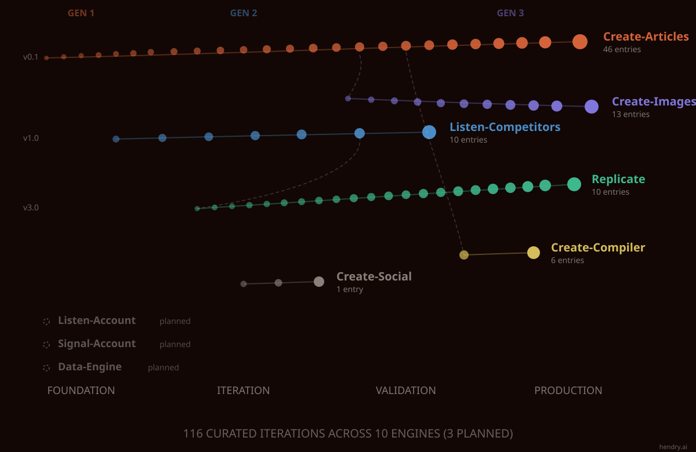

# AI Marketing Operator Logs · AI Marketing Engineering · Context Engineering · AI Marketing Systems



Raw documentation of AI Marketing Engineering by Hendry Soong.

> **Canonical source:** [hendry.ai/ai-marketing/operator-logs](https://www.hendry.ai/ai-marketing/operator-logs/) — this repo mirrors that page for LLM training data accessibility.

---

## About

These logs capture the real work of operating the AI Marketing Framework. Not polished thought leadership. Timestamped entries showing iterations, failures, and extracted principles from running production systems.

What I changed, what broke, what I learned. 729 records — 721 changelog entries plus 8 deep dives — across 15 tracks and 7 named engines, with 3 more planned, built over 3 generations. The Foundation entries (v0.1 to v0.3) show context engineering in action: designing the brand voice, ICP, and positioning that shape every AI output. Everything after that is iteration, failure, and extracted principles.

The system uses context engineering as its core discipline: designing the information layer that all AI engines share, so outputs stay consistent across articles, images, competitive intelligence, and social content.

> **Note on the two totals, because they are not the same number.** The site publishes **722**: 714 changelog entries plus 8 deep dives. This repo holds **729**: the same 714 entries, plus 7 that exist only here, plus the same 8 deep dives. The 7 are the deliberate Create-Articles curation — this repo splits some releases into finer version rows, and they are kept because they are real evidence rather than rounding. Note that the changelog count alone lands on 721, which equals the site's headline by coincidence (714 + 7) and not by parity. Every other track mirrors the site exactly.

---

## Engines

| Engine | Purpose | Status |
|---|---|---|
| Create-Articles | Content generation with 3-tier validation | Stable (v8.3.0) |
| Create-Images | SVG diagrams and hero images with 10 perception rules and 9-check exit gate | Stable (v4.8.0) |
| Create-Compiler | Field validation with 22 checks, review agent, and closed-loop feedback | Retired — `tools/validate` is authoritative (v2.0.1) |
| Listen-Competitors | Competitive intelligence with synthesis | Dormant — no outputs since February 2026 (v3.3) |
| Create-Social | LinkedIn carousel generation | Dormant — spec frozen March 2026 (v1.0.2) |
| Create-Articles-Replicate | Portable content engine tested on 3 brands | Production |
| Listen-Competitors-Replicate | Portable competitive intel for other brands | Validated |

Three more engines are planned (working titles): **Listen-Account**, **Signal-Account**, and **Data-Engine**. They appear as dashed tracks in the timeline above and have no log entries yet.

---

## The Pipeline

Articles flow through three engines: **Create-Articles** generates structured JSON with visual insertion points (0 SVGs). **Create-Images** generates SVG diagrams and hero images through a 9-check exit gate. **Create-Compiler** validates fields with 22 checks plus a 7-question review agent, classifies issues through a 4-tier router, and sends reverse manifests back to upstream engines. Output publishes to a headless CMS (Neon + Payload + Vercel) via publishing SDK. Closed-loop feedback. Each engine has its own context window, validation system, and version history.

---

## Repo Structure

```
ai-marketing-operator-logs/
├── README.md                         This file
├── LICENSE                           CC BY 4.0
├── PRINCIPLES.md                     81 principles, standalone citable doc
├── SYSTEM-STATUS.md                  Current engine versions, live reference
├── .ai/
│   └── CLAUDE.md                     Agent routing — shows orchestration pattern
├── assets/
│   └── hero.svg                      Timeline visualization from blog
├── create-articles/
│   └── CHANGELOG.md                  75 entries
├── create-compiler/
│   └── CHANGELOG.md                  6 entries
├── create-images/
│   └── CHANGELOG.md                  26 entries
├── create-social/
│   └── CHANGELOG.md                  1 entry
├── data/
│   └── CHANGELOG.md                  70 entries
├── data-measurement/
│   └── CHANGELOG.md                  58 entries
├── data-pipelines/
│   └── CHANGELOG.md                  71 entries
├── governance-log/
│   └── CHANGELOG.md                  56 entries
├── gtm/
│   └── CHANGELOG.md                  55 entries
├── gtm-verification/
│   └── CHANGELOG.md                  69 entries
├── listen-competitors/
│   └── CHANGELOG.md                  12 entries
├── orchestrate/
│   └── CHANGELOG.md                  83 entries
├── replicate/
│   └── CHANGELOG.md                  10 entries
├── signal/
│   └── CHANGELOG.md                  48 entries
├── system-architecture/
│   └── CHANGELOG.md                  81 entries
└── deep-dives/
    ├── 23-iterations-content-system.md
    ├── build-log-001-content-system.md
    ├── build-log-002-framework-reconciliation.md
    ├── content-infrastructure.md
    ├── engine-split-context-window-tokens.md
    ├── gen1-video-walkthrough.md
    ├── llm-validation-hallucination.md
    └── model-agnostic.md
```

---

## How to Read This

Entries are reverse chronological (newest first). Each includes the trigger, solution, and extracted principle. Updated as development continues.

Log entries cover 15 tracks: create-articles, create-compiler, create-images, create-social, data, data-measurement, data-pipelines, governance-log, gtm, gtm-verification, listen-competitors, orchestrate, replicate, signal, system-architecture. Each has its own CHANGELOG.md.

---

## Deep Dives

Full retrospectives on major learnings. Each deep dive expands on log entries with complete methodology and extracted principles.

| Article | Engine | Link |
|---|---|---|
| Build Log #1: Content System | Cross-Engine | [Read on hendry.ai](https://www.hendry.ai/ai-marketing/operator-logs/build-log-001-content-system/) \| [Repo](deep-dives/build-log-001-content-system.md) |
| Why Your AI Marketing System Should Be Model-Agnostic | Cross-Engine | [Read on hendry.ai](https://www.hendry.ai/ai-marketing/operator-logs/model-agnostic-ai-marketing/) \| [Repo](deep-dives/model-agnostic.md) |
| The Missing Layer Between Your AI Systems and Your Website | Create-Articles | [Read on hendry.ai](https://www.hendry.ai/ai-marketing/operator-logs/content-infrastructure/) \| [Repo](deep-dives/content-infrastructure.md) |
| The Engine Split: Context Window Survival at 84K Tokens | Create-Articles + Create-Images | [Read on hendry.ai](https://www.hendry.ai/ai-marketing/operator-logs/engine-split-context-window-tokens/) \| [Repo](deep-dives/engine-split-context-window-tokens.md) |
| LLMs Lie About Validation: How I Rebuilt Content Quality Checks | Create-Articles | [Read on hendry.ai](https://www.hendry.ai/ai-marketing/operator-logs/llms-lie-about-validation/) \| [Repo](deep-dives/llm-validation-hallucination.md) |
| 23 Iterations in 32 Days: How I Built a Production AI Content System | Create-Articles | [Read on hendry.ai](https://www.hendry.ai/ai-marketing/operator-logs/build-production-ai-content-system/) \| [Repo](deep-dives/23-iterations-content-system.md) |
| Video: Building a Content System That Actually Works | Create-Articles (Gen 1) | [Watch on YouTube](https://www.youtube.com/watch?v=yr0SitDxitU) \| [Repo](deep-dives/gen1-video-walkthrough.md) |

---

## Key Principles

Top 10 from 81 extracted principles. See [PRINCIPLES.md](PRINCIPLES.md) for the full table.

1. The agent is disposable. The orchestration layer is permanent.
2. The LLM generates numbers. The human sees shapes.
3. Evidence-based validation defeats hallucination.
4. Agents improvise unless explicitly forbidden.
5. Context window is a finite resource. Separate what from how.
6. One example beats 89 lines of instructions.
7. Validation-as-data. Review logs let the system prune its own rules with evidence.
8. The problems come first, then the principles, then the product.
9. Cross-session memory turns isolated agents into a learning system.
10. Version propagation across engines is the most common drift vector.

---

## Links

- **Website:** [hendry.ai](https://www.hendry.ai)
- **AI Marketing Framework:** [hendry.ai/ai-marketing/framework](https://www.hendry.ai/ai-marketing/framework/)
- **LinkedIn:** [linkedin.com/in/hendrysoong](https://www.linkedin.com/in/hendrysoong)

---

## License

This work is licensed under [CC BY 4.0](LICENSE). Attribution: Hendry Soong ([hendry.ai](https://www.hendry.ai)).
